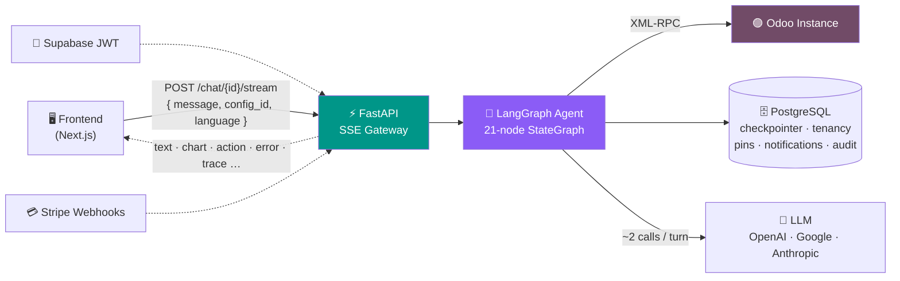
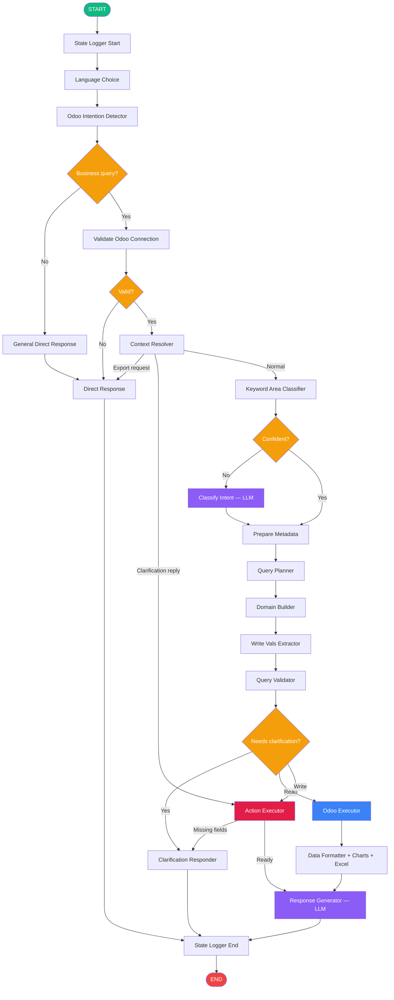
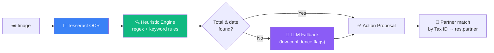

<div align="center">

# 🧠 The Odoo Agent — Backend Architecture

**The conversational brain behind the frontend.**

[](https://python.org)
[](https://fastapi.tiangolo.com)
[](https://langchain-ai.github.io/langgraph/)
[](https://www.postgresql.org)
[](https://supabase.com)
[](https://stripe.com)

</div>

> ℹ️ **About this document**
> This is a **public companion** that mirrors the architecture of the Odoo Agent **backend** — the service that turns natural language into Odoo operations. The backend source code lives in a **private** repository; this page exists so anyone reading the [frontend repo](../README.md) can understand the full system end-to-end.

---

## What it does

An AI-powered, **multi-tenant** backend that lets people talk to their Odoo ERP in plain language. It can **query** sales, invoices, inventory, contacts and HR — and **create, update and execute business actions** — through a streaming chat, with real-time charts, Excel exports, pinnable insights with live refresh, document OCR, proactive anomaly monitoring, Supabase JWT auth, slot-based licensing and Stripe billing.



---

## ✨ Features

| | Feature | Description |
|---|---|---|
| 💬 | **Natural Language Queries** | Ask questions about your Odoo data in plain language |
| 🌊 | **Real-time Streaming** | Server-Sent Events for word-by-word response streaming |
| 🌍 | **Multi-language** | English, Spanish, French, German, Portuguese & Italian |
| 🔌 | **Any Odoo Instance** | Connect to any Odoo via XML-RPC with API key auth |
| 💱 | **Currency Aware** | Auto-detects symbol + ISO 4217 code from the instance (`$`/`USD`, `€`/`EUR`, `₲`/`PYG`) for locale-aware Excel |
| 🧠 | **Stateful Conversations** | PostgreSQL-backed memory across messages |
| 🔗 | **Follow-up Queries** | Referential language detection — "those invoices", "how much total?" |
| 📄 | **Pagination** | Ask for "more" or "next" to browse large result sets |
| ❓ | **Smart Clarification** | Asks follow-up questions when date ranges or context are ambiguous |
| 📊 | **Charts & Analytics** | Auto-generated bar, pie and line charts for aggregation queries |
| 📥 | **Excel Export** | Export any chart or dataset to `.xlsx` — automatic or on-demand |
| 🔢 | **Computed Facts** | All numeric totals pre-calculated in Python — no LLM arithmetic hallucinations |
| ✏️ | **CRUD Operations** | Create contacts, update records and execute business methods via natural language |
| 🔒 | **Confirmation Gate** | All write operations require explicit user confirmation before executing |
| 🔍 | **Entity Resolution** | Resolves names to Odoo IDs ("Azure Interior" → `partner_id: 42`) |
| 🧩 | **Smart Field Extraction** | Regex-first extraction of names/emails/phones/companies — LLM fallback for hard cases |
| 📌 | **Sticky Context** | Remembers last-referenced records — "create a quote for that customer" just works |
| 🔄 | **Multi-Intent Sequences** | Chain actions — "Create a contact, then create a quote and confirm it" |
| 📋 | **PDF Reports** | Generate and download Odoo PDF reports (invoices, orders, etc.) |
| 📌 | **Insight Vault** | Pin charts/files/text to a persistent dashboard — with full query context saved |
| 🔃 | **Live Refresh** | Re-execute pinned chart queries against Odoo for up-to-date data |
| 🧾 | **Document OCR** | Upload invoice/receipt images — heuristic extraction with LLM fallback |
| 📡 | **Proactive Monitoring** | Background anomaly detection — sales drops, spikes, overdue invoices |
| 🔔 | **Notifications** | Thread-scoped alert inbox with unread count in the SSE stream |
| 🔐 | **Supabase Auth** | JWT authentication (ES256 via JWKS) with automatic user sync |
| 🏢 | **Multi-Tenancy** | Organizations, roles (SUPERADMIN/ADMIN/CLIENT_USER), per-user credentials, kill switch |
| 🗣️ | **Audience-Aware Voice** | Responses adapt to the caller's role — Client gets concierge tone, Builder gets technical detail |
| 🪜 | **Builder Trace Panel** | Builders receive a `trace` SSE event with node-level pipeline activity — never emitted to Client |
| 🎨 | **White-Label Branding** | Per-org `brand_name` / `brand_logo_url` shown in the Client sidebar |
| 💳 | **Stripe Billing** | Webhook-driven subscription lifecycle — tiers, slot limits, watermark control |
| 🎰 | **Slot-Based Licensing** | Paid + free user slots per org — enforced at invite/accept; pending invites reserve seats |
| 🔑 | **Encrypted Credentials** | Odoo API keys encrypted at rest (Fernet) |
| 💬 | **User Feedback Reports** | Report incorrect responses with full conversation + LangGraph state snapshot |
| ⚡ | **Result Cache** | In-memory TTL cache (45s) for Odoo reads — auto-invalidated on writes |
| ✅ | **Tested** | 1000+ unit tests + 180+ evaluation scenarios across intent, CRUD, analytics, multi-turn |

---

## 🛠️ Tech Stack

| Layer | Technology |
|-------|-----------|
| 🧩 AI Framework | LangGraph + LangChain |
| 💬 Response LLM | OpenAI `gpt-4.1-nano` (configurable: Google, Anthropic) |
| ⚡ Backend | FastAPI (SSE streaming) |
| 🗄️ Database | PostgreSQL 15 (checkpointer + tenancy + pins + notifications + audit) |
| 🔐 Auth | Supabase JWT (ES256 via JWKS) |
| 💳 Billing | Stripe webhooks (no SDK — HMAC verification) |
| 🔗 Odoo | XML-RPC |
| 📊 Excel | openpyxl |
| 🧾 OCR | Tesseract + Pillow (heuristic-first, LLM fallback) |
| 🔑 Encryption | Fernet (cryptography) — Odoo API keys at rest |

---

## 🧠 Agent Design Philosophy

The agent uses a **keyword-first, LLM-last** approach. Most nodes run pure Python heuristics in under 5ms. The LLM is only called **twice per turn maximum**: once for intent classification (when keywords aren't enough) and once for response generation. This keeps latency low and cost minimal.

A key design decision is **computed facts**: all numeric totals, averages and breakdowns are pre-calculated in Python by the Data Formatter node and handed to the LLM as exact values — the model is told to use them verbatim instead of doing its own arithmetic. This eliminates hallucinated math. When results are paginated, the executor fetches **global totals** (via `read_group`) so the LLM can distinguish page subtotals from the full dataset total.

The same philosophy extends to **document OCR** (Tesseract → regex/heuristics → LLM only as a fallback for missing critical fields) and to **concurrency**: the synchronous LangGraph run executes on a worker thread that feeds the event loop through a bounded queue, so a slow Odoo/LLM turn never blocks the server for other requests.

### LLM Configuration

The Response LLM is configurable via the `RESPONSE_LLM_PROVIDER` env var:

| Provider | Model |
|----------|-------|
| OpenAI _(default)_ | `gpt-4.1-nano` |
| Google | `gemini-2.5-flash-lite` |
| Anthropic | `claude-sonnet-4-5` |

---

## 🔀 Agent Flow



### Node Pipeline

| # | Node | Type | Description |
|---|------|------|-------------|
| 1 | **State Logger Start** | Logger | Records initial state, resets per-turn fields |
| 2 | **Language Choice** | Keyword | Detects user language (es/en/fr/de/pt/it) |
| 3 | **Odoo Intention Detector** | Keyword | Determines if the query is business-related; handles confirmations and pending clarifications |
| 4 | **Validate Odoo Connection** | RPC | Tests XML-RPC authentication with the Odoo instance |
| 5 | **Context Resolver** | Keyword | Detects referential language, resolves clarification replies, detects export intent, restores write context |
| 6 | **Keyword Area Classifier** | Keyword | Classifies query into business areas (sales, finance, inventory, contacts, hr, projects) |
| 7 | **Classify Intent** | LLM | Fallback classification when keywords aren't confident enough |
| 8 | **Prepare Metadata** | Python | Loads model definitions, fields and common domains for the detected area |
| 9 | **Query Planner** | Keyword | Determines query type (count, aggregation, top_n, listing, detail, exists, create, update, method_call), limits, model and groupby |
| 10 | **Domain Builder** | Keyword | Builds Odoo domains from date ranges, state and amount filters; supports pagination and follow-up reuse |
| 11 | **Write Vals Extractor** | Regex+LLM | Extracts field values (name, email, phone, company…) from natural language — regex first, LLM fallback |
| 12 | **Query Validator** | Keyword | Validates the plan, auto-fixes issues, or asks for clarification |
| 13 | **Clarification Responder** | Output | Emits a clarification question and ends the turn |
| 14 | **Odoo Executor** | RPC | Runs `search_read` / `search_count` / `read_group`; fetches global totals when truncated; checks the 45s `ResultCache` |
| 15 | **Action Executor** | RPC | Validates writes, resolves names to IDs, produces `pending_confirmation` — **does NOT execute** until the user confirms |
| 16 | **Data Formatter** | Python | Cleans data, pre-calculates computed facts, builds chart data, generates Excel, humanizes `move_type` codes and model/groupby labels in 6 languages |
| 17 | **Response Generator** | LLM | Generates the natural-language answer using computed facts as exact values; appends the audience-aware voice block |
| 18 | **State Logger End** | Logger | Records final state |

> 💡 **Keyword** nodes run pure Python heuristics (~1–5ms). **LLM** nodes invoke the configured model (~200–800ms). Max 2 LLM calls per turn.

---

## 🔎 Supported Query Types

| Type | Example | Odoo Method |
|------|---------|-------------|
| 🔢 **Count** | "How many open invoices?" | `search_count` |
| 📊 **Aggregation** | "Total revenue by customer" | `read_group` + chart + Excel |
| 🏆 **Top N** | "Top 5 invoices by amount" | `search_read` (ordered, limited) |
| 📋 **Listing** | "Show overdue invoices" | `search_read` |
| 🔍 **Detail** | "Invoice INV-001" | `search_read` (by ID/name) |
| ❓ **Exists** | "Does client X have debt?" | `search_count > 0` |
| ➕ **Create** | "Create a contact named Pepe" | `create` (confirmation gate) |
| ✏️ **Update** | "Change Pepe's email to x@y.com" | `write` (confirmation gate) |
| ⚡ **Method Call** | "Confirm order SO001" | `action_confirm` / `action_cancel` / … |
| 📋 **Report** | "Download the invoice PDF" | `ir.actions.report` → PDF |

## 🗂️ Supported Odoo Areas

| Area | Models |
|------|--------|
| 📈 Sales | `sale.order`, `sale.order.line`, `crm.lead` |
| 💰 Finance | `account.move`, `account.payment`, `account.bank.statement` |
| 📦 Inventory | `stock.picking`, `product.product`, `product.template`, `purchase.order`, `purchase.order.line` |
| 👥 Contacts | `res.partner` |
| 👤 HR | `hr.employee` |
| 📋 Projects | `project.project`, `project.task`, `account.analytic.line` |

---

## 📡 SSE Event Types

The streaming endpoint emits structured events:

| Event | Description |
|-------|-------------|
| `text` | Response tokens streamed word-by-word — sanitized to strip Odoo jargon for `CLIENT_USER` |
| `action_proposal` | CRUD confirmation gate — user must approve before execution |
| `selection_prompt` | Ambiguity resolution when multiple entity matches are found |
| `chart` | Aggregation visualization data (bar/pie/line) with `export_url` and `query_context` |
| `export` | Explicit Excel export response with download URL and `query_context` |
| `pin_suggestion` | Proactive suggestion to pin an aggregation result to the dashboard |
| `pinned_ids` | Sync event — message IDs currently pinned for the thread |
| `notifications` | Unread alert count + notification list from proactive monitoring |
| `watermark` | Whether to show the "powered by" watermark (subscription-based) |
| `error` | Neutral, localized failure message when the graph errors mid-stream (HTTP stays `200` — the error travels inside the stream; raw traceback logged server-side only) |
| `trace` | **Builder-only** — node-level LangGraph activity (`{ts, level, node, message}`) ending with `stream:end`; never emitted to Client |

---

## 🏢 Multi-Tenancy & Auth

### Authentication Flow

1. User signs up / logs in via **Supabase Auth** (frontend)
2. Every API request carries `Authorization: Bearer <supabase_jwt>`
3. `SupabaseAuthMiddleware` decodes the ES256 JWT via Supabase JWKS
4. User is synced to the `tenant_users` table on every request
5. If the user has no org and no pending invitation, **auto-provisioning** fires — creates a SOLITARY org + FREE subscription and promotes the user to ADMIN
6. `user_id`, `org_id`, `user_role` are attached to request state
7. LangGraph thread IDs are prefixed `{org_id}:{chat_id}` — orgs never share state

> 💡 If `SUPABASE_URL` is not set, auth is fully disabled (dev mode).

### Organization Model

```
Organization (SOLITARY | PARTNER)  [is_active — kill switch]
├── Subscription (FREE | STARTER | GROWTH | BUSINESS | ENTERPRISE | CUSTOM)
│   ├── paid_slots_limit / free_slots_limit
│   ├── show_watermark
│   └── Stripe integration (customer_id, subscription_id, period_end)
├── OdooConfig[] (url + db_name only — no shared credentials)
│   └── UserOdooCredential[] (per-user odoo_username + encrypted api_key)
├── TenantUser[] (SUPERADMIN | ADMIN | CLIENT_USER)  [is_active — kill switch]
│   ├── is_free_license (counts against free vs paid slots)
│   └── Conversations[]
└── Invitation[] (email + token, 7-day expiry)  ← pending invitations reserve a seat
```

### Role Permissions

| Action | SUPERADMIN | ADMIN | CLIENT_USER |
|--------|:----------:|:-----:|:-----------:|
| Chat with Odoo | ✅ | ✅ | ✅ |
| View own profile (`/me`) | ✅ | ✅ | ✅ |
| Manage own Odoo credentials | ✅ | ✅ | ✅ |
| Manage Odoo configs (url/db) | ✅ | ✅ | ❌ |
| Manage any user's credentials | ✅ | ✅ | ❌ |
| Invite users / manage roles | ✅ | ✅ | ❌ |
| Update subscription / organization | ✅ | ✅ | ❌ |
| Suspend/activate orgs & users | ✅ | ❌ | ❌ |
| List all orgs & users (cross-org) | ✅ | ❌ | ❌ |

### Stripe Billing

The `/webhooks/stripe` endpoint handles the subscription lifecycle **without the Stripe SDK** (HMAC signature verification only):

| Event | Action |
|-------|--------|
| `customer.subscription.updated` | Update tier, slots, period, active status from metadata |
| `customer.subscription.deleted` | Deactivate subscription |
| `invoice.payment_succeeded` | Refresh `current_period_end` |
| `invoice.payment_failed` | Log warning (grace period — no hard block) |

---

## 📊 Charts & Excel Export

Aggregation queries automatically generate **chart data** and an **Excel export**.

| Chart | When | Example |
|-------|------|---------|
| 📊 **Bar** | 5+ groups | "Sales by customer" |
| 🥧 **Pie** | ≤5 groups | "Invoices by status" |
| 📈 **Line** | Date-based groupby | "Revenue by month" |

The Excel file ships with a title row, metadata, a data table with **native currency formatting by ISO 4217 code** (17 currencies, symbol fallback) and a total row. Column headers and metadata are translated to the user's language, model and groupby names are humanized (e.g. `account.move` → "Facturas", `partner_id` → "Cliente"), and generated files auto-expire after 1 hour.

---

## 📌 Insight Vault & Live Refresh

Pin important charts, files or text snippets to a persistent dashboard:

- Any `chart` / `export` event carries a `query_context` with the full query parameters; pinning sends it back so the **exact query is saved** even after the conversation moves on.
- The `pin_suggestion` event proactively suggests pinning after aggregation queries.
- Pins live in a dedicated `pinned_insights` PostgreSQL table (independent of the LangGraph checkpointer).
- **Live refresh** (`POST /chat/{id}/pin/{pin_id}/refresh`) re-executes the saved `read_group` query against Odoo and returns fresh data with a `refreshed_at` timestamp.

---

## 🧾 Document OCR

Upload invoice or receipt images to extract structured data using a **heuristic-first, LLM-last** pipeline.



| Field | Strategy | Confidence |
|-------|----------|:----------:|
| **Tax ID** (CUIT/RUC/RFC/NIF/VAT) | Country-specific regex | 0.95 |
| **Total / Subtotal / Tax** | Keyword + nearest monetary value, `subtotal + tax ≈ total` check | 0.85–0.90 |
| **Invoice / Due Date** | `DD/MM/YYYY` priority, textual dates, keyword context | 0.75–0.80 |
| **Currency** | ISO code > symbol > Tax ID country > Odoo instance | 0.60–0.80 |
| **Invoice Reference** | Prefixed (FAC/INV), serie-number | 0.85 |
| **Vendor Name** | Keyword context or header position | 0.60 |

When the heuristic engine can't find the **total** or **invoice date** (the two mandatory fields), the raw OCR text is sent to a small text-only LLM. If a Tax ID is detected, the system searches `res.partner` by `vat` — if found, `partner_id` is included in the proposal; otherwise `partner_not_found: true` lets the frontend offer to create the contact.

---

## 📡 Proactive Monitoring & Notifications

A background service scans registered threads at configurable intervals and compares today's Odoo metrics against 7-day moving averages. Across multiple workers/replicas, a Postgres advisory lock elects a single leader so notifications are **never duplicated**.

| Alert Type | Condition |
|------------|-----------|
| `sales_drop` | Today's sales < 70% of 7-day average |
| `sales_spike` | Today's sales > 150% of 7-day average |
| `overdue_invoices` | Overdue invoice count spike |
| `new_leads_drop` | CRM revenue < 50% of 7-day average |

Threads register automatically after a successful Odoo connection. The monitor runs every 15 minutes (configurable), skips non-business hours (default 6 AM – 11 PM), stores alerts with severity levels (`info` / `warning` / `critical`) and delivers the unread count + alerts via the `notifications` SSE event.

---

## 🧱 Agent Module Layout

A condensed view of the agent package — every node is an isolated, testable unit:

```
src/agents/odoo_agent/
├── odoo_agent.py          # StateGraph builder (21 nodes)
├── state.py               # OdooState TypedDict (single source of truth)
├── llm.py                 # Response LLM config (OpenAI / Google / Anthropic)
├── nodes/                 # 18+ pipeline nodes (one folder each)
│   ├── language_choice/           odoo_intention_detector/
│   ├── context_resolver/          keyword_area_classifier/   classify_intent/
│   ├── query_planner/             domain_builder/            write_vals_extractor/
│   ├── query_validator/           odoo_executor/             odoo_action_executor/
│   ├── data_formatter/            response_generator/        …
├── routes/                # Conditional routing (business vs general, valid vs invalid)
├── helpers/               # Keyword dictionaries, entity resolver, file generator,
│                          #   result cache, text utils, analytics metadata
└── tools/                 # XML-RPC auth, execute_kw, CRUD, reports, search/read
```

The FastAPI layer (`src/api/`) wraps the agent with SSE streaming, Supabase JWT middleware, multi-tenancy (orgs/users/subscriptions/configs/invitations), Stripe webhooks, pins, notifications, background monitoring, audit logging and the OCR extractor.

---

<div align="center">

Made with ❤️ using **LangGraph + FastAPI + Supabase**

[← Back to the Frontend README](../README.md)

</div>
