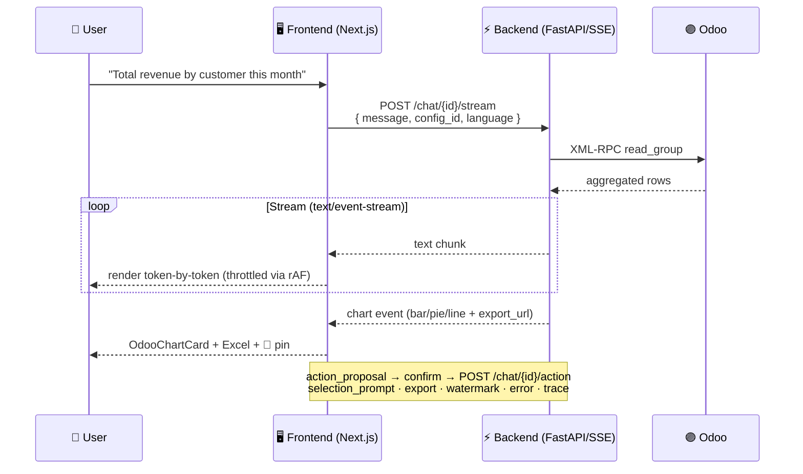

<div align="center">

# 🤖 The Odoo Agent — Frontend

**Talk to your Odoo ERP in natural language.**

[](https://nextjs.org/)
[](https://react.dev/)
[](https://www.typescriptlang.org/)
[](https://tailwindcss.com/)
[](https://supabase.com/)
[](https://www.framer.com/motion/)

A multi-tenant, **ChatGPT-style interface** that lets anyone query and manage their Odoo ERP — sales, invoices, inventory, contacts, HR — through an AI agent. Real-time **SSE streaming**, interactive **charts**, **action execution** with a confirmation gate, **document OCR upload**, a pinnable **insights dashboard**, proactive **notifications**, and a **dual-voice UI** that speaks differently to implementers and their end clients — in **11 languages**.

</div>

---

> ## 🔗 Want to see how the AI actually works?
>
> **This repo is the frontend.** The conversational intelligence — a **21-node LangGraph agent**, keyword-first/LLM-last pipeline, computed-facts engine, multi-tenant auth, OCR and proactive monitoring — lives in a separate backend service (private repo).
>
> ### 👉 **[Read the Backend Architecture →](DOCS/BACKEND_ARCHITECTURE.md)**
>
> Agent flow diagram · node pipeline · query planning · multi-tenancy & RBAC · Stripe billing · OCR extraction · the full SSE event contract.

---

## 🎯 What's Inside

This is a production-grade SaaS front end, not a toy chat box. At a glance:

| Pillar | Highlights |
|--------|-----------|
| 💬 **Conversational core** | SSE streaming, Markdown responses, image upload (vision), rotating suggestion carousel, date-grouped history |
| ⚡ **Action management** | AI-proposed CRUD with confirm/cancel, field editor + per-field validation, success/validation cards, ambiguity resolution, entity autocomplete, audit trail, auto-sequencing |
| 📊 **Analytics & export** | Interactive bar/line/pie charts (Recharts), automatic Excel export, standalone Excel/PDF download cards |
| 📌 **Insights dashboard** | Pin charts/files/exports to a right sidebar split into **Live** (refreshable) and **Saved** (point-in-time), flying-pin animation, optimistic updates |
| 🔔 **Notifications** | Proactive Odoo alerts with severity, unread badges, deep-link into chat, 30s polling |
| 🔐 **Auth & multi-tenancy** | Supabase auth + DEV MODE + Demo mode, org management, RBAC (SuperAdmin/Admin/Client), subscription tiers, team invitations, slot limits |
| 🎭 **Dual-voice UI** | Audience-aware copy & density — technical for Builders, concierge for Clients — custom brand mark, white-label "Powered by", LangGraph trace panel |
| 🌍 **i18n & theming** | 11 languages, light/dark mode with no-flash persistence, full design-token system, responsive collapsible layout |
| 🚀 **Landing intro surfaces** | Welcome modal (auto-opens once on first demo visit, dismissal persisted), info panel drawer ("¿Qué es TheOdooAgent?") reachable from the sidebar any time, in-flow **partner reframe nudge** (auto-expands after the 2nd successful demo response, minimizes to a persistent pill), first-party funnel analytics (`track()`, UTM capture, session stitching) |

> 💡 If this already looks broad — it is. Keep scrolling for the complete reference: project structure, provider stack, every UI card, auth flows, the multi-tenancy model, the full endpoint table and the SSE protocol.

### 🗺️ How a message flows



---

# 📖 Full Reference

## 📝 Description

A modern, responsive interface that allows users to query and manage data from their Odoo instance (inventory, invoices, sales, employees) using natural language through an AI-powered chat. Key features:

**💬 Core Chat:**
- Real-time chat with SSE streaming
- Rich Markdown-formatted responses
- Image upload with inline preview (vision-based AI interactions)
- Rotating suggestion carousel: 4 random cards from a pool of 11 active suggestions, auto-rotates every 7s, pauses on hover
- Conversation history grouped by date (today, yesterday, last 7 days)

**⚡ Action Management:**
- AI-proposed CRUD actions with confirm/cancel flow (from text and vision sources)
- Field editor modal with per-field validation (422 error handling)
- Visual feedback for write operations (create, update, method calls)
- Success cards with record links to Odoo
- Validation error prompts with missing field indicators
- Ambiguity resolution with interactive selection cards
- Entity autocomplete for Odoo model search
- Audit history popover for action execution trail
- Auto-sequencing: `queue_next` triggers follow-up actions automatically

**📊 Analytics & Export:**
- Interactive charts (bar, line, pie) powered by Recharts
- Automatic Excel export button on chart cards
- Standalone Excel download cards for explicit export requests
- PDF report download cards

**📌 Pinned Insights Dashboard:**
- Pin charts, files, and exports to a collapsible right sidebar
- Sidebar splits pins into **Live** (variable/refreshable charts, 2-col grid) and **Saved** (static/point-in-time charts + files + Excel, grouped below)
- Refresh button shown only for **live** (`volatility: "variable"`) charts — static charts are point-in-time, refresh is suppressed
- Static charts use Bookmark icons (save/saved) instead of Pin icons to convey point-in-time semantics
- Flying pin animation with spring physics
- Max 20 pins per user with optimistic UI updates
- **Global load:** all pins are fetched once on login (`GET /me/pins`) and merged across conversations; per-chat loads are skipped when already loaded
- **User-scoped clear:** `clearAll` calls `DELETE /me/pins` (removes all pins across every conversation for the user)
- **Defensive validation:** malformed pins (e.g., chart pin missing `chart` payload) are filtered out before rendering to prevent runtime crashes

**🔔 Notification System:**
- Proactive alerts from Odoo (sales, stock, invoices) with severity levels
- Notification feed in right sidebar (Alerts tab) with unread badge
- Mark as read (individual and bulk), dismiss
- Deep link: click notification to inject prompt into chat
- Configurable settings modal (toggle alerts by category, daily summary)
- Auto-polling every 30 seconds

**🔐 Authentication & Multi-Tenancy:**
- Supabase email/password authentication (DEV MODE bypass when unset)
- Demo mode: unauthenticated access when backend sets `demo_available` (banner in chat + "Try Demo" button on login)
- Organization management (name, slug, type)
- Role-based access control (SuperAdmin, Admin, Client User)
- Subscription tiers (Free, Starter, Implementor S/M/L/XL/XXL) with slot limits
- Team management: invite users **per instance** (seat paid/free + mode invite_only/precreds), toggle free/paid slots
- **Per-user Odoo Connection** lifecycle (`unset` / `active` / `invalid`) per instance — each user loads their own API key; blocking states surface a load/reload CTA
- First-instance onboarding gate (configure now vs keep exploring in demo) + two-block connect form with discriminated validation (unreachable / db_not_found / auth_failed)
- 402 payment limit modal (graceful degradation, no crash)

**⚙️ Configuration:**
- Dedicated **`/instances`** route (ADMIN): instance list with connection-status badges + health summary, instance detail with the users on each instance, per-instance invitations and edit (label vs url/db re-validation)
- Dedicated **`/settings/odoo`** route: every user self-manages their own Odoo Connection per instance (load / edit / revalidate credentials)
- Admin settings panel with 4 tabs (Org, Instances, Users, Feedback), each section a `CollapsibleCard`; the instance-create, invite and client-credential flows now live on the dedicated routes above, reached via `MovedToCard` pointers
- Odoo connection configuration, discriminated validation (`useConnectionValidator`), and instance inspection
- Multi-language support (Spanish, English, French, German, Portuguese, Italian, Hindi, Gujarati, Tamil, Kannada, Marathi)
- Light / dark mode with preference persisted in `localStorage` (no flash on reload)
- Collapsible and responsive sidebar (mobile-friendly)
- Accessibility: `aria-label` on all interactive icon buttons, `role="switch"` on toggles

**🎭 Builder vs Client (dual-voice UI):**
- Audience-aware copy: ADMIN / SUPERADMIN see technical strings (e.g. `create · sale.order`, `#42`, raw Odoo model names); CLIENT_USER and anonymous visitors see natural concierge copy (e.g. `Confirmar pedido`, `Tu factura #42 quedó emitida.`). Mapping from Odoo model → document type lives in `lib/odoo-model-to-doctype.ts`; translation keys in `Builder.*` and `Client.*` namespaces.
- Audience-aware density: icon sizes and button/input/card heights and radii scale up for Client (more spacious, larger tap targets) and stay compact for Builder, driven by CSS `--btn-h-*`, `--input-h`, `--*-radius` density tokens.
- Custom brand mark (`AgentMark`) replaces the generic `Bot` icon across the sidebar, chat avatar and empty-chat hero. `Wordmark` in the sidebar header. Discreet "Powered by TheOdooAgent" lockup (`PoweredBy`) shown only to Client (white-label-friendly: implementer's brand wins, TheOdooAgent stays as credit).
- LangGraph trace panel (`LangGraphTracePanel`): collapsible right-side dev panel showing node-level execution events, visible only to Builder. Currently a stub that emits synthetic `stream:start` / `stream:end` entries — wired to be replaced by the backend's SSE `trace` event when available.

**✨ Other:**
- Pricing page — bounces real `CLIENT_USER`s to `/chat`; Builder roles and anonymous/DEV-mode visitors can view it. In beta (`phase === "beta_founder"`) renders `FoundingPartnerPricing` (active Founding Partner card + Standard/Enterprise "coming soon" cards + informative-only `A11yModal` + billing indicator block); otherwise shows `PricingCards` (Free, Starter, Implementor tiers with Stripe checkout/portal). Prices come from `GET /billing/state` via `getBillingState()` and fall back to `BETA_BILLING_DEFAULTS` if unavailable — nothing is hardcoded. Accessible via the **Pricing** entry in the user menu (`Tag` icon)
- Founder free-beta clock (Fase 0) — a per-org window (`founder_since` / `beta_ends_at` / `days_left` on `MeOrg`/`BillingState`/`SuperAdminOrg`) that starts the moment a founder connects + validates their first instance. `FounderClockPill` floats a subtle "X days left" pill at the top of `/settings` (Builder-only, real-founder-only); informative, not enforcement — hitting 0 days doesn't cut access. Superadmin's Orgs tab shows a "Founder" column with days left and an "Extend beta" action (`±days`, presets 7/30/90) via `superadminExtendFounderBeta()`

## 🏗️ Architecture

### 🧩 Tech Stack

**Core:**
- **Next.js 16** - React framework with App Router
- **React 19** - UI library
- **TypeScript 5** - Static typing

**Auth:**
- **Supabase** - Email/password authentication + session management

**Email:**
- **nodemailer** - Server-side SMTP (Zoho) for sending localized invitation emails from `app/api/send-invitation` (optional — disabled when SMTP env vars are unset)

**Styling & UI:**
- **Tailwind CSS v4** - CSS utilities (configured via `@theme`)
- **Framer Motion** - Smooth animations and transitions
- **Lucide React** - Icon library

**Charts:**
- **Recharts** - Composable charting library (bar, area, pie)

**Internationalization:**
- **next-intl** - Locale-based routing, 11 supported languages

**Rendering:**
- **react-markdown** - Markdown rendering for agent responses

### 📁 Project Structure

```
app/
  [locale]/
    layout.tsx                  # Root layout with provider stack (9 nested contexts)
    page.tsx                    # Auth-based redirector — delegates to resolvePostAuthPath (SUPERADMIN→/superadmin; ADMIN/no-org with 0 instances→/onboarding unless demo-skipped; else→chat)
    login/page.tsx              # Supabase email/password login (+ DEV MODE bypass; "Forgot password?" link)
    register/page.tsx           # Account signup → resolvePostAuthPath redirect
    invite/page.tsx             # Accept team invitation by token (post-accept: connectionStatus "unset"→/settings/odoo, else→/chat)
    forgot-password/page.tsx    # Password recovery step 1: request a 6-digit OTP by email
    reset-password/page.tsx     # Password recovery step 2: verify OTP + set new password
    superadmin/page.tsx         # Superadmin panel (standalone, no AppShell)
    (app)/
      layout.tsx                # AppShell wrapper (ChatContext + RightPanelContext); only wraps app routes
      chat/page.tsx             # New query (rotating carousel: 4 random suggestions from pool of 11 + input)
      chat/[id]/page.tsx        # Conversation with SSE streaming
      onboarding/page.tsx       # First-instance gate (configure now vs keep demo) + two-block connect form with discriminated validation
      instances/page.tsx        # ADMIN-only: instance list (status badge + health summary) + add-instance form (1st always; 2nd+ PARTNER-only)
      instances/[id]/page.tsx   # ADMIN-only: instance detail — users + per-user Connection status, pending invites, per-instance invite (seat + mode, gated on isPartner = org.type === "PARTNER"), edit
      settings/odoo/page.tsx    # Self-service: the current user manages their own Odoo Connection per instance (load/edit/revalidate credentials)
      settings/page.tsx         # Admin panel: org, users, feedback + MovedToCard pointers to /instances and /settings/odoo
      pricing/page.tsx          # Subscription plans — Builder-only (Client users bounced to /chat); renders FoundingPartnerPricing in beta phase or PricingCards otherwise; prices from getBillingState()
  api/
    send-invitation/route.ts    # Server-side route handler: sends the localized invitation email via Zoho SMTP (nodemailer); SMTP secrets never reach the client; verifies caller via /me before sending
  globals.css                   # Theme variables (light/dark) + markdown styles
components/
  app-shell.tsx                 # Wrapper with ChatContext + RightPanelContext; mounts LangGraphTracePanel for builder roles; wraps layout in IntroProvider + PartnerNudgeProvider; mounts IntroModal + IntroPanel; calls captureUtm() on mount
  AgentMark.tsx                 # Brand mark primitives: MarkB, MarkI, Wordmark, Lockup
  theme-initializer.tsx         # Client component: applies .dark class from localStorage on every route change (default theme is light unless `theme==='dark'`)
  auth/
    auth-guard.tsx              # Login redirect HOC (checks auth, shows spinner)
  intro/
    intro-modal.tsx             # Welcome modal (auto-opens once on first demo visit; dismissed state persisted in localStorage `toa_intro_dismissed`)
    intro-panel.tsx             # Info drawer panel — reachable any time from the sidebar "¿Qué es?" item
    intro-sidebar-item.tsx      # Sidebar entry point for the info panel; fires `info_opened_from_panel` analytics event
    partner-nudge.tsx           # Surface C — in-flow demo nudge (expanded ↔ pill) pushing the partner/reseller reframe; rendered in both chat pages when isDemoMode
    a11y-modal.tsx              # Accessible modal primitive (focus trap, Esc-to-close, body scroll lock, ARIA wiring; `containerClassName` controls anchoring — full-screen on mobile)
  chat/
    sidebar.tsx                 # Collapsible sidebar + history (paginated); delegates bottom nav to UserMenu; collapse uses PanelLeft/PanelLeftClose/PanelLeftOpen icons with hover-swap; collapsed body is clickeable to expand; mounts FoundingPartnerBadge below Wordmark in expanded header
    user-menu.tsx               # Popover menu (bottom of sidebar): IntroSidebarItem ("¿Qué es?"), avatar/initials, Instances (ADMIN) + My connection links, settings, Pricing link (Tag icon — shown to Builder and to anonymous/DEV-mode users; hidden for CLIENT_USER), superadmin link, theme toggle, language sub-menu, instance sub-menu (lists all configs; non-ready ones route to /settings/odoo "set up to chat"), login/logout, PoweredBy (Client only)
    chat-messages.tsx           # Message bubbles with metadata + charts + image handling + feedback button (shown when allow_feedback)
    feedback-modal.tsx          # Modal to report an AI message (category + comment + expected response)
    chat-input.tsx              # Auto-resizing input with image upload + send/stop
    demo-banner.tsx             # Banner shown in demo mode (short "Demo Mode" text on mobile); CTA routes to /onboarding (0 instances) or /settings/odoo (has instance, no active Connection), else /register (logged-out)
    odoo-config-selector.tsx    # Dropdown to switch active Odoo config + credential status indicator
    success-card.tsx            # Green card for successful actions
    validation-prompt.tsx       # Orange card for missing fields
    odoo-action-button.tsx      # Purple action confirmation button
    action-proposal-button.tsx  # AI-proposed CRUD action confirm/cancel with field editor
    selection-card.tsx          # Multi-option selector for ambiguity resolution
    odoo-file-card.tsx          # PDF report download card
    odoo-chart-card.tsx         # Interactive charts (bar/line/pie) + Excel export + pin
    excel-export-card.tsx       # Standalone Excel download card
    audit-history-popover.tsx   # Action execution history timeline
    entity-autocomplete.tsx     # Odoo model search with debounced autocomplete
    langgraph-trace-panel.tsx   # Builder-only collapsible right-side trace panel (stub; replace with SSE `trace` event when available)
  pinned/
    pinned-sidebar.tsx          # Collapsible right sidebar (pins + alerts tabs)
    pinned-insight-mini-card.tsx # Compact card with refresh (charts) + unpin
    pin-toggle-button.tsx       # Reusable pin/unpin toggle on chart/file cards
    flying-pin-animation.tsx    # Spring-animated flying pin portal
  notifications/
    notification-feed.tsx       # Notification list with mark-all-read
    notification-card.tsx       # Individual alert card with time-ago
    notification-settings-modal.tsx # Toggle alerts by category
  settings/
    user-credentials-section.tsx      # Section for users to save their own Odoo credentials; CLIENT_USER: single-instance block; ADMIN: accordion per config
    admin-user-credentials-modal.tsx  # Admin modal to manage credentials for any org user; CLIENT_USER: single block with instance switcher + pencil edit; ADMIN: accordion per config
    admin-invitation-credentials-modal.tsx  # Admin modal to pre-load credentials for a pending invitation; CLIENT_USER: single block (ClientPendingCredentialBlock); ADMIN: accordion (PendingConfigPanel)
  odoo/
    connection-form.tsx         # Legacy Odoo connection form (saves via POST /admin/orgs/{id}/configs)
    instance-inspector.tsx      # View installed Odoo modules
    connection-status-badge.tsx # unset/active/invalid/pending pill (icon + label, never color-only)
    connection-invalid-banner.tsx # Per-user "connection down" notice + reload-API-key CTA
    credential-blocks.tsx       # Two-block "instance data vs your credentials" form scaffolding
    credential-form.tsx         # Shared credential editor (url+db read-only, user+apikey editable; validates on save)
    instance-create-form.tsx    # Create instance N (creator credentials optional from the 2nd)
    instance-health-summary.tsx # Active/unset/invalid/pending counts + seat usage at a glance
    invite-user-form.tsx        # Per-instance invite (seat paid/free + mode invite_only/precreds; blocks existing accounts)
    odoo-apikey-helper.tsx      # Collapsible "how to generate your Odoo API key" steps
  pricing/
    pricing-cards.tsx           # Plan cards (Free, Starter, Implementor); accepts currentTier prop; Stripe checkout/portal CTAs; Implementor detail modal
    founding-partner-pricing.tsx # Founding Partner beta pricing: active founder card (rate from BillingState) + Standard/Enterprise "coming soon" cards (informative-only A11yModal on click)
  ui/
    error-toast.tsx             # Toast notification provider + display
    limit-reached-modal.tsx     # 402 payment limit upgrade modal
    password-input.tsx          # Password field with show/hide toggle (Eye/EyeOff)
    doc-num.tsx                 # Document number: `.docnum` pill for Client (only mono surface they see), `font-technical` plain for Builder
    powered-by.tsx              # Discreet "Powered by TheOdooAgent" lockup (Client-only footer)
    founding-partner-badge.tsx  # "Founding Partner" badge — shown in expanded sidebar header below Wordmark; Builder-only by architecture (returns null for Client); gated on org.is_founding_partner !== false AND org.founder_since being set (real founder = connected + validated their first instance)
    founder-clock-pill.tsx      # Floating "X days left" free-beta pill (Fase 0); Builder-only + real-founder gating (same as badge); mounted top-left of /settings
    info-tooltip.tsx            # Inline hover/tap help tooltip (audience-neutral); used for the Founding Partners program/scarcity copy on /register
hooks/
  use-auth.tsx                  # Supabase auth context (login/register/logout, DEV MODE stub; password recovery via OTP: requestPasswordReset/verifyRecoveryCode/updatePassword; updateUserLang persists UI lang to metadata for localized emails)
  use-session.tsx               # /me endpoint context (user/org/subscription/odoo_configs bootstrap; always loads, even unauthenticated)
  use-chat.ts                   # Chat state + SSE + image upload + action execution + clearChats (resets all chat state on logout)
  use-odoo-config.tsx           # Odoo config context; selection driven by per-user `connection_status === "active"` (chat-ready); activeConfigId persisted in localStorage; isDemoMode flag
  use-connection-validator.ts   # Wraps validateConnection with UI state (OK: company + version | discriminated error_code + per-field errors)
  use-pinned-insights.tsx       # Pinned insights context (pin/unpin/refresh/clear/loadAllPins); defensive payload validation
  use-notifications.tsx         # Notification context (polling/read/dismiss/settings)
  use-limit-reached-modal.tsx   # 402 limit modal context (listens to auth:limit_reached event)
  use-audience-translations.ts  # `useAudienceT(ns)` → translator scoped to `Builder.<ns>` or `Client.<ns>` based on role
  use-icon-size.ts              # `useIconSize(slot)` → role-aware icon size (builder: 16/20/24, client: 18/22/28)
  use-intro.tsx                 # IntroProvider + useIntro: shared state for intro modal + info panel (open/close, dismissal persisted in localStorage `toa_intro_dismissed`)
  use-partner-nudge.tsx         # PartnerNudgeProvider + usePartnerNudge: event-driven nudge state machine (hidden → expanded after 2nd demo success → pill on minimize); dismissal persisted in localStorage `toa_partner_nudge_dismissed`
lib/
  api.ts                        # Centralized API client (30+ endpoints, authFetch with 401/402); tenant refactor adds validateConnection, fetchInstanceDetail, revalidate{My,User}Credential, CreateInvitationOptions; sendInvitationEmail() posts to the internal /api/send-invitation route; getBillingState() fetches render-only billing context (falls back to BETA_BILLING_DEFAULTS)
  post-auth.ts                  # resolvePostAuthPath(meData) + onboarding-skip flag helpers (localStorage `toa_onboarding_skipped`)
  types.ts                      # TypeScript interfaces (Message, Metadata, Action, Charts, Multi-tenant, Analytics; tenant refactor: OdooConnectionStatus, SeatType, InvitationMode, InstanceDetail/InstanceUser/InstanceInvitation, ValidateResult/ValidateErrorCode, InstanceCounts/InstanceSeats; Fase 0: BillingPhase, BillingState, MeOrg.is_founding_partner?, MeOrg.founder_rate_locked?)
  invitation-email.ts           # Localized copy + HTML/text builder for the invitation email (es/en/fr/de/pt/it); content only — transport lives in app/api/send-invitation/route.ts
  supabase.ts                   # Supabase client singleton + IS_AUTH_ENABLED + getAccessToken
  analytics.ts                  # First-party analytics: track(), captureUtm(), getSessionId() — fire-and-forget events to POST /events; captures utm_* on app mount and stitches them to later signup via session_id
  pin-animation-events.ts       # Pub-sub system for flying pin animations
  odoo-model-to-doctype.ts      # Maps Odoo model (`account.move`, `sale.order`, …) → user-facing docType (`invoice`, `order`, …) for Client copy
i18n/                           # Routing, request config, navigation (Link/Router wrappers)
messages/                       # Translations (es, en, fr, de, pt, it, hi, gu, ta, kn, mr)
proxy.ts                        # Locale detection middleware
```

### 🧬 Provider Stack

The root layout nests 9 context providers in this order:

```
NextIntlClientProvider
  → AuthProvider (Supabase user)
    → SessionProvider (/me bootstrap: org, subscription, slots)
      → OdooConfigProvider (localStorage)
        → ToastProvider (error notifications)
          → LimitReachedModalProvider (402 modal)
            → NotificationProvider (30s polling)
              → PinnedInsightsProvider (pin state)
                → [root layout ends here]
                  → AppShell (ChatContext + RightPanelContext)  ← only inside (app)/ route group
                    → IntroProvider (intro modal + panel state)  ← inside AppShell
                      → PartnerNudgeProvider (partner reframe nudge state)
```

## 🧩 UI Components

The interface uses specialized cards to handle different response types from the AI agent:

### ✅ SuccessCard
Displayed when the agent successfully performs a write operation:
- Green card with CheckCircle icon
- Shows record ID and name
- **Dual-voice:** Builder sees technical headline + raw record name + `font-technical` `#id` + "View in Odoo" link. Client sees natural copy keyed by action × docType (e.g. `Tu factura #42 quedó emitida.`) via `Client.ActionSuccess.<action>.<docType>` translations; record id is wrapped in `<DocNum>` (warm-raised pill); Odoo link is hidden.

### ⚠️ ValidationPrompt
Displayed when required fields are missing:
- Orange card with AlertCircle icon
- Lists missing fields as bullet points
- Guides user to provide complete information

### 🟣 ActionProposalButton
AI-proposed CRUD action with confirm/cancel flow:
- Purple button using Odoo brand color (#714B67)
- Shows action summary (model, operation, data)
- **Field editor modal** with inline editing and validation
- Handles 422 per-field validation errors from backend
- User-edited field indicators (badge showing "Modified")
- Confirm executes the action; cancel shows a translated cancellation message
- Loading and completed states with visual feedback
- **Dual-voice:** Builder header shows uppercase `action · model` and uses the backend-provided `action_btn` label verbatim. Client header shows neutral "Confirmar acción" and the CTA label comes from `Client.ActionProposal.verb.<action>.<docType>` (e.g. "Confirmar pedido", "Descargar") with a `.generic` fallback per action.

### ⚡ OdooActionButton
Interactive button for confirmable method calls:
- Purple button using Odoo brand color
- Loading state with spinner during execution
- Completed state with checkmark
- Example: "Confirm Quotation", "Approve Purchase Order"

### 🔀 SelectionCard
Displayed when the agent needs to resolve ambiguity:
- Lists matching records as selectable options
- Clicking an option sends the selection back as a chat message

### 📄 OdooFileCard
PDF report download card:
- Red-themed icon for PDF files
- Shows filename and download button
- Links to backend-served static file

### 📊 OdooChartCard
Interactive analytics visualization:
- Supports bar, line (area), and pie charts via Recharts
- Responsive layout with horizontal bars on narrow containers
- Custom tooltip with formatted values (currency, integer, decimal)
- Axis tick values auto-compacted (K / M / B / T) for large numbers; `no_decimals` flag suppresses decimal places
- Purple color palette matching Odoo branding
- Footer with global total and group-by info
- **Excel export button** appears when `export_url` is present (ghost style, top-right)
- **Pin button** to save chart to pinned insights sidebar

### 📥 ExcelExportCard
Standalone Excel download card for explicit export requests:
- Green Excel icon (#1D6F42) matching Microsoft Excel branding
- Shows filename and "export ready" message
- Download button with `download` attribute to force browser download

### 📌 PinnedInsightMiniCard
Compact card displayed in the pinned insights sidebar:
- **Chart cards:** Icon by chart type (bar/pie/line) + live dot (variable) or "Histórico" badge (static), title, formatted total (`K`/`M` abbreviation for large currency values), refresh + unpin buttons in top-right hover area
- **File cards:** Red PDF icon, filename, download link, unpin button
- **Excel cards:** Green Excel icon, filename, download link, unpin button
- Refresh button appears only on **live** (`volatility: "variable"`) chart cards and only when not in demo mode and an active Odoo config exists — static charts never refresh
- Buttons revealed on hover with smooth opacity transition

### 🔔 NotificationCard
Individual alert displayed in the notification feed:
- Severity-based color coding (critical, warning, info, success)
- Title, body, and relative timestamp ("5 min ago")
- Read/unread visual state
- Click to dismiss or deep-link into chat with prompt injection

### ⌨️ ChatInput
Auto-resizing textarea with image upload support:
- Paperclip button opens native file picker (`accept="image/*"`)
- Selected image shows as 64px thumbnail preview with X to remove
- Supports sending text only, image only, or both together
- Enter to send, Shift+Enter for newline

### 🕓 AuditHistoryPopover
Action execution history timeline:
- Shows all actions executed in the current conversation
- Displays action type, model, record IDs, status
- Highlights user-edited fields vs system values
- Empty state when no actions have been executed

### 🔍 EntityAutocomplete
Odoo model search with autocomplete:
- Debounced search against backend (`/chat/{id}/search`)
- Dropdown with matching records (id + name)
- Used within ActionProposalButton field editor

### 🅰️ AgentMark
Brand-mark primitives used across the app instead of the generic `Bot` icon:
- `MarkB` — block mark (used in sidebar header, chat AI avatar, empty-state hero)
- `MarkI` — alternate mark (used in the typing indicator)
- `Wordmark` — "TheOdooAgent" text mark used in the expanded sidebar header
- `Lockup` — mark + wordmark lockup used by `PoweredBy`

### 🪜 LangGraphTracePanel
Builder-only collapsible right-side trace panel for visualising LangGraph node execution:
- Shown only when `meData?.user?.role` is `ADMIN` or `SUPERADMIN`
- Collapsed by default as a floating pill with event count; expands to a fixed 320px aside
- Each entry: timestamp, level (`ok` / `info` / `err` / `warn`), node, message
- **Currently a stub** — entries are synthesized in `AppShell` on each `isStreaming` transition. Replace with the backend's SSE `trace` event when available.

### #️⃣ DocNum
Renders a document number with audience-aware styling:
- Client (CLIENT_USER + anonymous): `.docnum` pill — Roboto Mono on a warm-raised background; the **only** mono surface the Client sees
- Builder (ADMIN/SUPERADMIN): plain `.font-technical` — mono is already pervasive for them, no pill

### 🏷️ PoweredBy
Discreet "Powered by TheOdooAgent" lockup intended for the Client sidebar footer only — supports partial white-labelling (the implementer's brand stays visually dominant; TheOdooAgent stays as a credit).

### 🔌 Tenant & Connection components (`components/odoo/`)
A family of components introduced by the onboarding/tenant refactor:
- **ConnectionStatusBadge** — `unset` / `active` / `invalid` / `pending` pill; status is always icon **and** label (never color alone)
- **ConnectionInvalidBanner** — per-user "connection down" notice with a reload-API-key CTA; isolated to the user whose Connection went `invalid`
- **CredentialForm** — shared credential editor: inherited url+db shown read-only, username+API key editable; validates on save (`auth_failed`), API key never re-shown
- **CredentialBlocks** — the two-block "instance data (shared) vs your credentials (personal)" form scaffolding used by onboarding and instance creation
- **InstanceCreateForm** — create instance N; creator credentials optional from the 2nd instance onward
- **InstanceHealthSummary** — at-a-glance active / unset / invalid / pending counts + seat usage
- **InviteUserForm** — per-instance invite with seat (paid/free) and mode (invite_only / precreds); blocks an email that already has an account
- **OdooApiKeyHelper** — collapsible "how to generate your API key in Odoo" steps shown next to API-key fields

## 🔐 Authentication & User Flows

### 👋 Unauthenticated User

```
App loads → GET /me (no auth token)
         → redirected to /chat
            → demo_available: false → /chat (no demo, login link visible in sidebar)
            → demo_available: true  → /chat (Demo Mode)
                                       activeConfigId = "demo"
                                       banner shown in chat
                                       "Try Demo" button on login page
```

> Demo Mode lets visitors interact with the AI using a read-only Odoo demo instance — no account required. Unauthenticated users always land on `/chat` first; a "Sign in" link is visible in the sidebar bottom nav.

### 🔑 Authenticated User (any role)

```
App loads → AuthProvider restores Supabase session
         → SessionProvider calls GET /me
         → resolvePostAuthPath(meData) decides the landing route:
            → SUPERADMIN                          → /superadmin (standalone panel, no app shell)
            → ADMIN / no-org with 0 instances     → /onboarding (first-instance gate, inside AppShell) — unless demo-skipped
            → otherwise                           → /chat
            (a fresh signup already has an auto-provisioned SOLITARY org but no instance, so the gate keys on instance count, not org presence)
         → 401 from any API call → check active Supabase session → if session exists: clear session → /login; if no session: ignore (unauthenticated user hitting protected endpoint)
                                    (public paths exempt from redirect: /login, /register, /invite, /onboarding, /forgot-password, /reset-password)
         → 402 from any API call → show LimitReachedModal (no crash)
```

### 🛡️ Admin User

Admins have access to `/settings` (4-tab panel, each section a `CollapsibleCard`). After the tenant refactor, the instance, invite and self-credential flows moved to dedicated routes — Settings shows `MovedToCard` pointers to them:

```
Settings
├── Org tab
│   ├── Organization  → edit name, slug, org type
│   └── (CLIENT_USER) → "Your Odoo connection" card → /settings/odoo
├── Instances tab
│   ├── Manage instances card → /instances  (create, validate, configure)
│   └── Inspector             → inspect installed Odoo modules
├── Users tab
│   ├── Users           → list members, change role, toggle free/paid slot, remove
│   │                      seats widget (paid X/limit · free X/limit) in section subheader
│   ├── Invite users card → /instances  (inviting is now per-instance, with seat + mode)
│   ├── Sent Invitations → status (pending / accepted / expired), show/copy link, cancel (frees seat)
│   └── (SOLITARY org)  → upgrade banner with contact CTA
└── Feedback tab
    └── Feedback      → list of feedback reports submitted by org users; expandable rows with 3 tabs:
                        Data (category, comment, expected response, admin_notes), Messages (conversation snapshot),
                        Note (tenant_notes: internal note editable by admin)

/instances (ADMIN-only route)
├── Instance list   → status badge + health summary per instance; add (1st always; 2nd+ PARTNER-only)
└── Instance detail → users on this instance (per-user Connection status + inline load-creds for unset/invalid),
                      pending invitations, per-instance invite (seat paid/free + mode invite_only/precreds),
                      edit (label · url/db with re-validation warning)

/settings/odoo (any user)
└── My Odoo Connection → load / edit / revalidate your own credentials per instance (unset → CTA, invalid → reload, active → edit)
```

Role comparison:

| Capability | CLIENT_USER | ADMIN | SUPERADMIN |
|------------|:-----------:|:-----:|:----------:|
| Chat & query Odoo | ✓ | ✓ | ✓ |
| Submit feedback on AI messages | per `allow_feedback` flag | per `allow_feedback` flag | per `allow_feedback` flag |
| View plans/pricing link | — | ✓ | ✓ |
| View settings | — | ✓ | ✓ |
| Manage Odoo connections | — | ✓ | ✓ |
| Manage users & invitations | — | ✓ | ✓ |
| View org feedback reports | — | ✓ | ✓ |
| Edit organization | — | ✓ | ✓ |
| Cross-org administration | — | — | ✓ |
| Delete a user completely (Postgres + Supabase auth) | — | — | ✓ |
| Feedback dashboard + full triage | — | — | ✓ |
| Landing analytics events tab | — | — | ✓ |

### ✉️ Invitation Flow

```
Admin sends invite (email) → POST /admin/orgs/{id}/invitations  (backend mints token only)
                           → front sends localized email via POST /api/send-invitation (Zoho SMTP)
                             best-effort: link stays copyable as fallback if the email fails
                             accept link: /invite?token=...

Invitee opens link → GET /admin/invitations/{token}/preview  (no auth)
                   → renders without app shell (no sidebar, no chat context)
                   → shows registration form
                      email  (pre-filled, read-only)
                      org name + role badge
                      password field (with show/hide toggle)
                   → submit:
                      1. POST Supabase signUp  → gets accessToken
                      2. POST /admin/invitations/accept  (Bearer accessToken) → { instanceId, connectionStatus }
                      3. reload /me → redirect: connectionStatus "unset" (invite_only) → /settings/odoo (load API key)
                                                connectionStatus "active" (precreds)   → /chat

Error states:
  token missing / invalid → "Invitation not found"
  token expired (410)     → "Invitation expired"
  already accepted (409)  → "Already used" + go to chat button
```

> The invitation page handles registration inline — the invitee never needs to visit `/login` or `/register` separately.

### 🔁 Password Recovery Flow

```
Login page "Forgot password?" link → /forgot-password

Step 1 (/forgot-password):
  enter email → requestPasswordReset(email) → supabase.auth.resetPasswordForEmail(email)
              → OTP flow (no redirectTo) → backend emails a 6-digit code
              → anti-enumeration: a non-existent email does NOT error; always advance to step 2
              → 429 → rateLimited message
              → redirect /reset-password?email=...

Step 2 (/reset-password):
  enter 6-digit code + new password (×2) →
     1. verifyRecoveryCode(email, code) → supabase.auth.verifyOtp({ type: "recovery" }) → opens session
     2. updatePassword(newPassword)     → supabase.auth.updateUser({ password })
     3. success screen → "Go to sign in"
  resend code (with cooldown timer) → requestPasswordReset(email) again
```

> Transactional emails are localized via `user_metadata.lang`. `register(email, password, lang)` persists it on signup and `updateUserLang(lang)` (called from `UserMenu` on locale switch) keeps it in sync. Only locales the email templates support (`SUPPORTED_EMAIL_LANGS` in `lib/supabase.ts`: es/en/fr/de/pt/it) are stored — others fall back to the bilingual EN/ES email.

### 🧪 DEV MODE

When `NEXT_PUBLIC_SUPABASE_URL` is unset:
- `IS_AUTH_ENABLED = false`
- `useAuth()` returns stub user `dev@localhost`
- Login page shows "Continue without login" bypass button
- No token sent to backend (backend must also be in DEV MODE)

## 🏢 Multi-Tenancy Model

| Concept | Values | Description |
|---------|--------|-------------|
| **Roles** | `SUPERADMIN`, `ADMIN`, `CLIENT_USER` | Per-user permission level |
| **Org Types** | `PARTNER`, `SOLITARY` | Multi-client vs single company |
| **Subscriptions** | `FREE`, `STARTER`, `IMPLEMENTOR_S`, `IMPLEMENTOR_M`, `IMPLEMENTOR_L`, `IMPLEMENTOR_XL`, `IMPLEMENTOR_XXL` | Tier with slot limits |
| **Slots** | `paid_slots_limit`, `free_slots_limit` | Max users per org by type |
| **Odoo Configs (Instances)** | `OdooConfigSummaryWithCreds[]` | Multiple Odoo connections per org; carry instance metadata (`company_name`, `odoo_version`) + the caller's own `connection_status`; selection driven by `connection_status === "active"` |
| **Odoo Connection** | `OdooConnectionStatus` = `unset` / `active` / `invalid` | Per-user, per-instance credential lifecycle (spec §4). `unset` = assigned but no valid key (blocking); `active` = validated; `invalid` = auth failed, flagged per user |
| **Seats / Invitations** | `SeatType` (`paid`/`free`), `InvitationMode` (`invite_only`/`precreds`) | Invitations are per instance: pick a seat + whether the invitee loads their own key (invite_only) or the admin pre-loads it (precreds → active on accept) |
| **Demo Mode** | `demo_available: boolean` | Backend flag enabling unauthenticated access; `activeConfigId = "demo"`. Authed users with no active Connection also fall back to demo (banner CTA → setup) |
| **allow_feedback** | `boolean` (per user, on `MeUser`) | When `true`, a "Report" button appears on hover over the **last AI message** only. Users submit reports with optional category (`wrong_answer`, `crash`, `misunderstood`, `other`), comment, and expected response. Managed via PATCH `/admin/orgs/{id}/users/{id}`. |

**Admin controls** are split across `/settings` and the dedicated routes:
- Organization name/slug/type editing (`/settings`)
- Odoo instances: list, create (1st always; 2nd+ PARTNER only), edit, configure per-user connections (`/instances`, `/instances/[id]`)
- Users: list, change role, toggle free/paid, remove (`/settings`); SOLITARY shows an upgrade banner
- Invitations: created per instance with seat + mode (`/instances/[id]`); status list + cancel in `/settings`
- Self-service: any user loads/edits/revalidates their own Odoo credentials (`/settings/odoo`)

## 🔌 Communication Flow

```
┌─────────────┐     POST /chat/{id}/stream      ┌─────────────────┐
│             │  ──────────────────────────────►  │                 │
│   Frontend  │     { message, odoo_config }      │     Backend     │
│  (Next.js)  │                                   │  (FastAPI/SSE)  │
│             │  ◄──────────────────────────────  │                 │
└─────────────┘     text/event-stream (SSE)       └─────────────────┘
                    chunks with optional metadata

┌─────────────┐     POST /chat/{id}/upload      ┌─────────────────┐
│             │  ──────────────────────────────►  │                 │
│   Frontend  │     multipart/form-data (image)   │     Backend     │
│  (Next.js)  │                                   │  (FastAPI/OCR)  │
│             │  ◄──────────────────────────────  │                 │
└─────────────┘     JSON (action_proposal)        └─────────────────┘
```

**Consumed endpoints:**

| Method | Endpoint | Description |
|--------|----------|-------------|
| `GET` | `/me` | Current user + org + subscription |
| `POST` | `/me/onboarding` | Setup org + Odoo connection (409 on slug conflict) |
| `GET` | `/me/conversations` | Chat history (paginated with limit/offset) |
| `POST` | `/chat/{id}/stream` | Send message + receive SSE response with metadata (body: `{ message, config_id, language }`) |
| `POST` | `/chat/{id}/upload` | Upload image (multipart) + receive JSON with action proposal (field: `config_id`) |
| `POST` | `/chat/{id}/action` | Execute confirmable action (body: `{ config_id, action, context, language }`) |
| `GET` | `/chat/{id}/history` | Load full message history for a conversation (query param: `config_id`) |
| `GET` | `/chat/{id}/audit` | Action execution history (audit trail) |
| `POST` | `/chat/{id}/search` | Odoo entity name_search (body: `{ model, query, config_id }`) |
| `GET` | `/me/pins` | Fetch all pinned insights for the current user across every conversation |
| `DELETE` | `/me/pins` | Clear all pins for the current user (user-scoped) |
| `GET` | `/chat/{id}/pins` | Fetch all pinned insights for a chat |
| `POST` | `/chat/{id}/pin` | Create a new pin (chart, file, or excel) |
| `DELETE` | `/chat/{id}/pin/{pinId}` | Delete a specific pin |
| `POST` | `/chat/{id}/pin/{pinId}/refresh` | Refresh a pinned chart with updated data |
| `DELETE` | `/chat/{id}/pins` | Clear all pins for a chat |
| `GET` | `/chat/{id}/notifications` | Fetch notification list (filterable) |
| `PATCH` | `/chat/{id}/notifications/{id}/read` | Mark notification as read |
| `PATCH` | `/chat/{id}/notifications/read-all` | Mark all notifications as read |
| `POST` | `/test-connection` | Discriminated connection validation (`validateConnection`) → `{ ok, company_name, odoo_version }` or `{ ok:false, error_code, field_errors }` |
| `POST` | `/inspect-instance` | Fetch installed Odoo modules |
| `POST` | `/admin/orgs` | Create organization |
| `PATCH` | `/admin/orgs/{id}` | Update organization (name, slug, type) |
| `PATCH` | `/admin/orgs/{id}/type` | Change org type (`PARTNER` ↔ `SOLITARY`) — superadmin only |
| `POST` | `/admin/orgs/{id}/founder/extend-beta` | Extend (or shorten, negative `days`) a founder org's free-beta window (Fase 0) — superadmin only; returns the updated `founder_since`/`beta_ends_at`/`days_left` |
| `POST` | `/admin/superadmin/users/{id}/promote` | Create a new org for a user with no org (legacy accounts without auto-provisioning) — superadmin only |
| `DELETE` | `/admin/superadmin/users/{id}` | Permanently delete a user from Postgres **and** Supabase auth (`superadminDeleteUser`); query `delete_empty_org` also collapses a SOLITARY org left empty. Returns per-table `deleted` counts + a `supabase_auth` status (`deleted`/`not_found`/`skipped_not_configured`/`failed`) — a `200` does not guarantee the Supabase side succeeded — superadmin only |
| `GET` | `/admin/orgs/{id}/configs` | List Odoo connections (enriched with counts/seats/status) |
| `GET` | `/admin/orgs/{id}/configs/{id}` | Instance detail (`fetchInstanceDetail`): users ∩ instance + pending invitations + counts/seats |
| `POST` | `/admin/orgs/{id}/configs` | Create Odoo connection (optional creator creds; 422→errorCode, 409→solitaryBlocked) |
| `PATCH` | `/admin/orgs/{id}/configs/{id}` | Update Odoo connection (label, or url/db with re-validation) |
| `DELETE` | `/admin/orgs/{id}/configs/{id}` | Delete Odoo connection |
| `GET` | `/admin/orgs/{id}/users` | List organization users |
| `PATCH` | `/admin/orgs/{id}/users/{id}` | Update user (role, is_free_license, allow_feedback) |
| `DELETE` | `/admin/orgs/{id}/users/{id}` | Remove user from organization |
| `POST` | `/admin/orgs/{id}/invitations` | Create invitation (per instance: `instance_id`, `seat_type`, `mode`, optional prefilled creds; 409→seatLimitReached/emailHasAccount) |
| `GET` | `/admin/orgs/{id}/invitations` | List invitations |
| `DELETE` | `/admin/orgs/{id}/invitations/{invId}` | Cancel a pending invitation (frees seat immediately) |
| `POST` | `/admin/invitations/accept` | Accept invitation by token → `{ instanceId, connectionStatus }` (drives post-accept redirect) |
| `GET` | `/me/odoo-credentials` | List current user's saved credentials (one per config) |
| `PUT` | `/me/odoo-credentials/{configId}` | Save/update current user's credentials for a config (422→errorCode `auth_failed`) |
| `POST` | `/me/odoo-credentials/{configId}/revalidate` | Re-validate the current user's stored credential (`revalidateMyCredential`) |
| `GET` | `/admin/orgs/{id}/users/{userId}/odoo-credentials` | Admin: list all credentials for a user (returns `AdminUserCredential[]`) |
| `GET` | `/admin/orgs/{id}/users/{userId}/odoo-credentials/{configId}` | Admin: get a user's credentials for a specific config |
| `PUT` | `/admin/orgs/{id}/users/{userId}/odoo-credentials/{configId}` | Admin: save/update a user's credentials for a config (empty strings = assign instance without credentials) |
| `POST` | `/admin/orgs/{id}/users/{userId}/odoo-credentials/{configId}/revalidate` | Admin: re-validate a user's stored credential (`revalidateUserCredential`) |
| `DELETE` | `/admin/orgs/{id}/users/{userId}/odoo-credentials/{configId}` | Admin: delete a user's credentials for a config |
| `POST` | `/billing/checkout` | Create Stripe checkout session for a given tier |
| `POST` | `/billing/portal` | Create Stripe billing portal session |
| `POST` | `/chat/{id}/feedback` | Submit user feedback for a message (body: `{ config_id, message_id?, user_comment?, category?, expected_response? }`) |
| `PATCH` | `/chat/{id}/feedback/{feedbackId}` | Update tenant notes on a feedback report (body: `{ tenant_notes }`) |
| `GET` | `/admin/feedback` | List feedback reports (filterable by status, category, org_id; paginated) |
| `GET` | `/admin/feedback/stats` | Feedback statistics (total, 24h, 7d, by_status, by_category, top_orgs) |
| `GET` | `/admin/feedback/{id}` | Fetch single feedback report detail |
| `PATCH` | `/admin/feedback/{id}` | Update report (status, admin_notes, is_hidden) |
| `DELETE` | `/admin/feedback/{id}` | Delete feedback report |
| `POST` | `/events` | Emit a landing funnel analytics event — body: `{ event, props, utm, session_id, ts }` (fire-and-forget, no auth required; auth token attached when available) |
| `GET` | `/admin/events` | List analytics events (filterable by event, session_id, utm_source, utm_campaign, date range, has_user; paginated) — superadmin only |
| `GET` | `/admin/events/stats` | Analytics stats dashboard: total, 24h, 7d, unique_sessions, by_event, funnel, by_utm_source, top_example_prompts, dismissals_by_reason — superadmin only |

### 📡 SSE Event Types

The backend sends typed events in the SSE stream. Each event has an explicit `type` field:

**Text Chunk (streaming response):**
```json
{
  "type": "text",
  "content": "I found 5 contacts in your database..."
}
```

**Action Proposal (CRUD confirmation):**
```json
{
  "type": "action_proposal",
  "action": {
    "action": "create",
    "model": "res.partner",
    "vals": { "name": "Juan Perez", "email": "juan@example.com" },
    "target_ids": [],
    "status": "pending_confirmation"
  },
  "labels": {
    "action_btn": "Create Contact",
    "confirm_btn": "Confirm",
    "cancel_btn": "Cancel",
    "cancelled_msg": "Action cancelled. How else can I help you?"
  }
}
```

**Selection Prompt (ambiguity resolution):**
```json
{
  "type": "selection_prompt",
  "field": "partner_id",
  "searchValue": "Juan",
  "options": [
    { "index": 0, "id": 42, "name": "Juan Perez" },
    { "index": 1, "id": 43, "name": "Juan Garcia" }
  ]
}
```

**Chart (analytics visualization):**
```json
{
  "type": "chart",
  "chart_type": "bar",
  "title": "Sales by Product",
  "data": [
    { "label": "Product A", "value": 15000 },
    { "label": "Product B", "value": 8500 }
  ],
  "meta": {
    "value_label": "Revenue",
    "value_format": "currency",
    "currency_symbol": "$",
    "currency_iso": "USD",
    "no_decimals": false,
    "group_by": "product",
    "model": "sale.order",
    "period": "2026-02",
    "total": 23500
  },
  "export_url": "/static/reports/sales_by_product_abc123.xlsx"
}
```

**Export (explicit Excel export request):**
```json
{
  "type": "export",
  "export_url": "/static/reports/export_abc123.xlsx",
  "filename": "sales_report_2026_02.xlsx"
}
```

**Watermark (subscription-based):**
```json
{
  "type": "watermark",
  "show": true
}
```

**Error (terminal — backend graph failed mid-stream):**
```json
{
  "type": "error",
  "detail": "Ocurrió un error procesando tu consulta. Por favor, intentá de nuevo."
}
```

This event signals that the backend graph failed partway through the stream. The HTTP status stays `200` — the failure travels *inside* the stream, so `response.ok` is not enough to detect it. It is **terminal**: no useful events follow, and the frontend cancels the reader after handling it. `detail` arrives already localized (in the request `language`) and neutral (no model names or stack traces), so it is shown as-is. Any partial text already streamed is kept and the error is appended below it (`⚠️ {detail}`); if no text was streamed yet, the error message stands alone. Handled in `hooks/use-chat.ts`.

The `labels` field in action proposals contains translated UI text based on the `language` sent in the request. The frontend uses these labels directly for button text and cancellation messages.

### 🖼️ Image Upload Response

The `/chat/{id}/upload` endpoint accepts `multipart/form-data` with `file`, `odoo_config` (JSON string), and `language` fields. It returns a regular JSON response (not SSE):

```json
{
  "message": "I found an invoice in the image. Here's what I extracted:",
  "type": "action_proposal",
  "action": {
    "action": "create",
    "model": "account.move",
    "vals": { "partner_id": 42, "amount_total": 1500.00 },
    "target_ids": [],
    "status": "pending_confirmation"
  },
  "labels": {
    "action_btn": "Create Invoice",
    "confirm_btn": "Confirm",
    "cancel_btn": "Cancel",
    "cancelled_msg": "Action cancelled."
  }
}
```

The frontend renders the uploaded image in the user's message bubble and displays the action proposal below the assistant's response using the same `ActionProposalButton` component used for SSE-based proposals.

### 🔃 Pin Refresh Response

The `POST /chat/{id}/pin/{pinId}/refresh` endpoint re-queries Odoo and returns the updated chart data:

```json
{
  "status": "ok",
  "new_payload": {
    "type": "chart",
    "chart_type": "bar",
    "title": "Sales by Product",
    "data": [{ "label": "Product A", "value": 16200 }],
    "meta": { "value_label": "Revenue", "value_format": "currency", "currency_symbol": "$", "group_by": "product", "model": "sale.order", "period": "2026-02", "total": 16200 }
  },
  "refreshed_at": "2026-02-24T15:30:00Z"
}
```

### ✅ Action Confirmation Responses

The `/chat/{id}/action` endpoint returns:

**Success (201 - Create):**
```json
{
  "status": "ok",
  "message": "Contact created successfully (ID: 42)",
  "result": { "action": "create", "model": "res.partner", "id": 42 }
}
```

**Success (200 - Update):**
```json
{
  "status": "ok",
  "message": "Contact updated successfully (IDs: [42])",
  "result": { "action": "update", "model": "res.partner", "ids": [42], "success": true }
}
```

**Success (200 - Report):**
```json
{
  "status": "ok",
  "message": "Report generated successfully",
  "result": { "action": "report", "model": "account.move", "ids": [1], "file_url": "/static/reports/invoice.pdf", "filename": "INV-2026-001.pdf" }
}
```

**Error Responses:**
- **400** - Validation error (missing fields, invalid data)
- **401** - Odoo authentication failed
- **402** - Payment limit reached (triggers LimitReachedModal)
- **422** - Odoo business error (constraint violation, per-field errors)
- **500** - Odoo execution error

**Auto-sequencing:** The response may include a `queue_next` field with `{ text: string }` to automatically trigger a follow-up action after a short delay.

**Backward Compatibility:**
The parser still supports the old format without `type` field for gradual migration:
```json
{"content": "..."}
```

## 🚀 Setup

### 📋 Requirements

- **Node.js 18+**
- Backend running at `http://localhost:8000` ([odoo-agent-back](../odoo-agent-back))
- **Supabase project** (optional — leave unset for DEV MODE)

### 🔧 Environment Variables

```bash
# Supabase Auth (leave empty for DEV MODE — no auth, no token)
NEXT_PUBLIC_SUPABASE_URL=https://your-project.supabase.co
NEXT_PUBLIC_SUPABASE_ANON_KEY=sb_publishable_...

# Backend API base URL (default: http://localhost:8000)
NEXT_PUBLIC_API_BASE=http://localhost:8000

# Invitation email transport — server-side only (leave unset to disable email;
# the invitation still gets created and the admin can copy the link manually)
ZOHO_SMTP_HOST=smtp.zoho.com           # default smtp.zoho.com
ZOHO_SMTP_PORT=465                     # 465 (SSL) or 587 (STARTTLS); default 465
ZOHO_SMTP_USER=martin@theodooagent.com # Zoho account
ZOHO_SMTP_PASS=                        # Zoho app-specific password
INVITE_EMAIL_FROM=TheOdooAgent <martin@theodooagent.com>  # default
INVITE_EMAIL_REPLY_TO=                 # optional — replies routed here (e.g. when FROM is no-reply@)
APP_BASE_URL=https://theodooagent.com  # used to build the accept link; default https://theodooagent.com
```

### 📦 Installation

```bash
# Install dependencies
npm install

# Start development server
npm run dev
```

Open `http://localhost:3000` — it automatically redirects based on auth state.

### 🧰 Available Scripts

| Command | Description |
|---------|-------------|
| `npm run dev` | Development server (hot reload) |
| `npm run build` | Production build |
| `npm run start` | Production server |
| `npm run lint` | Linting with ESLint |

## 🎨 Themes and Design

The color system supports **light and dark mode** with CSS variables defined in `app/globals.css` under `@theme`. Components use semantic utility tokens — never raw hex values.

Theme preference is persisted in `localStorage` under the key `theme` (`"dark"` | `"light"`). The `ThemeInitializer` component (mounted in `<body>` in `app/[locale]/layout.tsx`) applies the `.dark` class on every route change via `usePathname`, ensuring the correct theme is always active across navigations.

### 🎟️ Design Token System

| Token | Role | Example usage |
|-------|------|---------------|
| `bg-base` | Page background | `<div className="bg-base">` |
| `bg-surface` | Card/panel background | `<div className="bg-surface">` |
| `bg-raised` | Elevated element (hover, input bg) | `hover:bg-raised` |
| `text-foreground` | Primary text | `<p className="text-foreground">` |
| `text-text-secondary` | Secondary/label text | `<label className="text-text-secondary">` |
| `text-text-muted` | Placeholder / de-emphasized text | `placeholder:text-text-muted` |
| `bg-accent` / `text-accent` | Interactive primary (replaces `primary`) | buttons, active states |
| `bg-accent-hover` | Hover state for accent buttons | `hover:bg-accent-hover` |
| `bg-accent-subtle` / `text-accent` | Accent tint (icon backgrounds) | icon wrappers |
| `bg-error` / `text-error` | Destructive actions | delete buttons, error messages |
| `bg-error-subtle` | Error tint | hover on delete, inline errors |
| `text-success-solid` | Success color | success icons |
| `text-warning-solid` | Warning color | warning icons, badges |
| `text-info` | Info color | info icons |
| `border-border` | Default border | all card/input borders |

### 🔠 Typography Tokens

| Token | Usage |
|-------|-------|
| `text-heading` | Section headings (`h1`/`h2`) |
| `text-subheading` | Sub-section headings |
| `text-body` | Default body text (replaces `text-sm`) |
| `text-small` | Secondary labels (replaces `text-xs`) |
| `text-micro` | Captions, badges, timestamps |
| `font-technical` | Monospaced/code values (slugs, URLs, IDs) |

### 🌈 Component Color Coding

- Success cards use `text-success-solid` / `bg-success-subtle`
- Validation prompts use `text-warning-solid` / `bg-warning-subtle`
- Action buttons use `--color-odoo-purple` (`#714B67`) — Odoo brand color
- PDF file cards use `text-error` red accent
- Excel export cards use `#1D6F42` (Excel green)
- Charts use Odoo purple palette
- Notification severity: critical (`text-error`), warning (`text-warning-solid`), info (`text-info`), success (`text-success-solid`)

### 📐 Density Tokens (Builder vs Client)

Beyond color, the design system exposes density tokens in `app/globals.css` that scale button/input/card heights and radii. They map to Tailwind v4 utilities via `--spacing-*` and `--radius-*`:

| CSS variable | Tailwind utility | Role |
|--------------|------------------|------|
| `--btn-h-sm`  | `h-btn-sm` / `w-btn-sm` | Small button (default 40px) |
| `--btn-h-md`  | `h-btn-md` / `w-btn-md` | Default button height (44px) |
| `--btn-h-lg`  | `h-btn-lg` / `w-btn-lg` | Large CTA (48px) |
| `--input-h`   | `min-h-input` / `h-input` | Inputs / textareas (44px) |
| `--btn-radius`   | `rounded-btn` | Button / input corner radius |
| `--input-radius` | `rounded-input` | Input corner radius |
| `--card-radius`  | `rounded-card` | Card / modal corner radius |
| `--layout-gap`   | `gap-layout-gap` | Standard layout gap |

The defaults baked into `:root` correspond to the **Client** density (larger, more spacious — appropriate for anonymous / demo visitors before `/me` resolves). Builder density is applied by swapping the variable values on a `.builder` / `.client` class scope.

Pair these tokens with `useIconSize(slot)` for icons (slot `inline` | `button` | `heading`) so a single component stays visually consistent across audiences.

### 💫 Shape & Animation Conventions

- Cards / modals: `rounded-card` token (literal fallback: `rounded-lg`)
- Buttons / inputs / small elements: `rounded-btn` token (literal fallback: `rounded-md`)
- Button height: `h-btn-md` (use `h-btn-sm` / `h-btn-lg` for variants)
- Icons: size via `useIconSize(...)` (or 20px literal in static surfaces), `strokeWidth={1.5}` throughout
- Animations: `duration-0.15` + `ease: "easeOut"` (replaced spring physics)

### 🗣️ Audience-Aware Strings & Icons

User-facing copy and icon sizes split by audience (role):

- **Builder** = `ADMIN` or `SUPERADMIN` — execution-oriented, mono-friendly, exposes Odoo internals (e.g. "EJECUTANDO · fetch_records", "ValidationError", `sale.order`).
- **Client** = `CLIENT_USER` + anonymous — concierge style, no jargon, document numbers only (e.g. "Lista", "No pude conectarme con tu sistema").

Read strings via `useAudienceT("<namespace>")` which resolves to `Builder.<namespace>` or `Client.<namespace>` automatically. Keys must exist under **both** roots in every `messages/*.json` — keep them in lockstep across all eleven locales.

Read icon sizes via `useIconSize(slot)`:

| Slot | Builder | Client |
|------|--------:|-------:|
| `inline`  | 16 | 18 |
| `button`  | 20 | 22 |
| `heading` | 24 | 28 |

## 🌍 Supported Languages

| Code | Language |
|------|----------|
| `es` | Spanish (default) |
| `en` | English |
| `fr` | French |
| `de` | German |
| `pt` | Portuguese |
| `it` | Italian |
| `hi` | Hindi |
| `gu` | Gujarati |
| `ta` | Tamil |
| `kn` | Kannada |
| `mr` | Marathi |

Translations are located in `messages/[locale].json`.

### 🔑 Translation Key Namespaces

| Namespace | Description |
|-----------|-------------|
| `Metadata` | Page title and description |
| `Sidebar` | Collapse/expand labels, empty state |
| `UserMenu` | Bottom sidebar popover: avatar, settings, instances, my connection, theme, language, instance switcher, login/logout |
| `ChatGroups` | Date-based grouping labels |
| `NewChat` | Welcome screen and suggestions |
| `ChatInput` | Input placeholder, disclaimer, image attach/remove, send/stop aria labels |
| `ChatMessages` | Chat UI: typing, success, validation, selection, file, chart, export, action proposal, audit, feedback button |
| `Feedback` | Feedback modal: title, categories, comment, submit/cancel, success toast |
| `ChatHistory` | Loading states |
| `Pricing` | Plans, features, and CTAs |
| `Settings` | Inspector, security, admin panel (org, users, invitations, feedback reports) + `MovedToCard` pointers (instances / invite / your connection) |
| `Instances` | Instance list/detail: title, add/edit, status labels, users, seats, invitations |
| `Connection` | Self-service Odoo Connection page + invalid-connection banner (`{company}` interpolated) |
| `Odoo` | `Odoo.apiKeyHelper.*` — "how to generate your API key in Odoo" steps |
| `PinnedInsights` | Pin/unpin tooltips, empty state, error messages |
| `Notifications` | Alert feed, settings, time labels |
| `Auth` | Login, register, DEV MODE bypass |
| `Onboarding` | First-instance gate (configure now / keep demo) + two-block connect form, validation errors |
| `LimitReachedModal` | 402 payment limit message |
| `Invite` | Invitation acceptance (loading, success, error, expired) |
| `LocaleSwitcher` | Language names |
| `Intro` | Landing intro surfaces: `Intro.sidebarItem` (sidebar entry label), `Intro.modal.*` (welcome modal copy, example prompts, chips), `Intro.panel.*` (info drawer copy, sections, CTAs), `Intro.nudge.*` (partner reframe nudge: eyebrow, title, body, CTAs, pill/minimize labels) |
| `Builder.*` | Builder-voice strings — read via `useAudienceT("<ns>")` when role is ADMIN/SUPERADMIN. Includes `Builder.Trace` (LangGraph panel) and `Builder.ChatMessages` (e.g. typing indicator: "Ejecutando · query"). |
| `Client.*` | Client-voice strings — read via `useAudienceT("<ns>")` when role is CLIENT_USER or anonymous. Includes `Client.ChatMessages`, `Client.ActionSuccess.<action>.<docType>` (success card headlines) and `Client.ActionProposal.verb.<action>.<docType>` (confirm-button labels). Every entry must have a `.generic` fallback. |
| `FoundingPartner` | Badge label shown in the sidebar header for founding-partner orgs (`FoundingPartner.badge`) + free-beta clock copy (`clockDaysLeft`, `clockExpired`, `clockTooltip`) for `FounderClockPill`. Implementer-facing — hi/gu/ta/kn/mr carry English text. |

---

<div align="center">

### 🧠 The intelligence behind the chat

The agent that powers every response — its 21-node LangGraph pipeline, query planning, computed-facts engine, OCR and multi-tenancy — is documented separately.

**[📖 Read the Backend Architecture →](DOCS/BACKEND_ARCHITECTURE.md)**

Built with ❤️ using **Next.js 16 · React 19 · TypeScript · Tailwind CSS v4**

</div>
